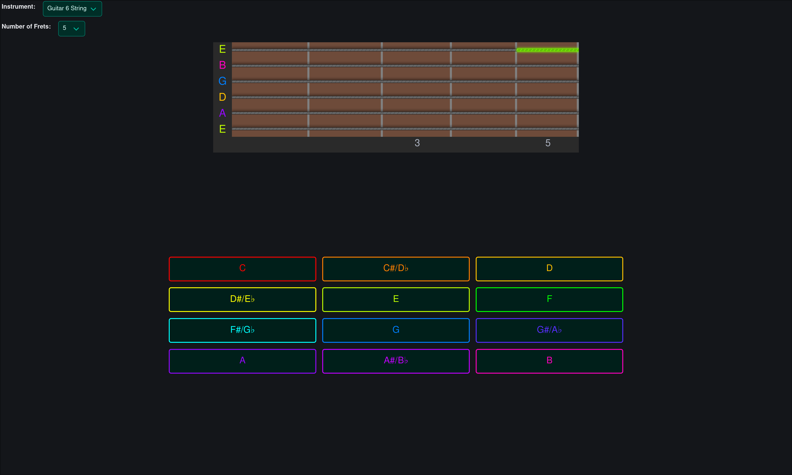
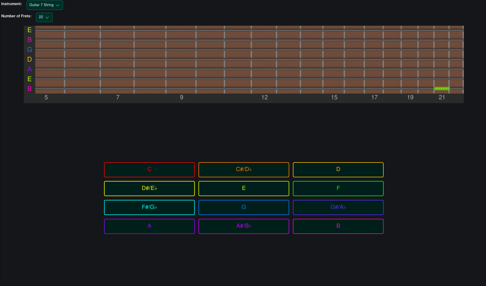
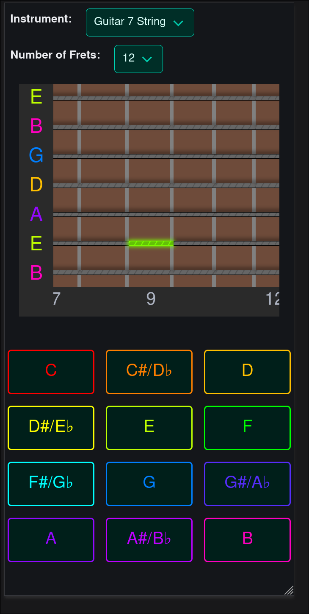

<div align="center">



# 🎸 Fretboard Memorizer

**A responsive, browser-based practice tool for learning notes on guitar and bass fretboards**

[](https://fretboard-memorizer.netlify.app/)
[](https://github.com/a-jadczak/fretboard-memorizer/commits)
[](https://github.com/a-jadczak/fretboard-memorizer)
[](https://github.com/a-jadczak/fretboard-memorizer)

</div>

## 📋 Table of Contents

- [🎯 Overview](#-overview)
  - [❓ Problem](#-problem)
  - [💡 Solution](#-solution)
- [✨ Features](#-features)
- [🚀 Demo](#-demo)
- [🖼️ Screenshots](#️-screenshots)
- [🛠️ Tech Stack](#️-tech-stack)
- [🧩 Challenges](#-challenges)
- [🏁 Getting Started](#-getting-started)
- [📖 Usage](#-usage)
- [🧪 Code Quality](#-code-quality)
- [📁 Project Structure](#-project-structure)
- [📄 License](#-license)

## 🎯 Overview

### **Fretboard Memorizer is a single-page web application for practicing note recognition on guitar and bass fretboards.**

The application highlights a random fretboard position and asks the user to identify its note. A correct answer moves the exercise to another position, creating a continuous practice loop.

Users can choose an instrument preset, adjust the number of frets, or focus on a single string with a configurable open-string note.

### ❓ Problem

Learning the notes across a fretboard requires repeated practice. Static diagrams provide a reference, but they do not actively test recall or adapt the exercise to a particular instrument.

### 💡 Solution

The application turns a fretboard diagram into an interactive exercise. Random positions encourage active recall, while instrument presets and adjustable fret counts let users choose the scope of their practice.

## ✨ Features

### Randomized note recognition

Identify the note at the highlighted string and fret using the on-screen note buttons. Correct answers immediately trigger a new position, while incorrect answers leave the current position active for another attempt.

### Guitar and bass presets

Choose from **6-, 7-, or 8-string guitar** presets and **4- or 5-string bass** presets.

Each preset generates the fretboard from its predefined tuning.

### Single-string practice

Focus on one string and choose its open-string note. This provides a smaller practice area before moving on to a full fretboard.

### Adjustable fret count

Choose **5, 12, 22, or 24 frets** to control how much of the fretboard is included in the exercise.

### Responsive fretboard

The fretboard uses progressively narrower fret spacing and a horizontally scrollable layout. Automatic scrolling follows the selected practice position.

### Saved preferences

The selected instrument, fret count, and single-string note are saved in **localStorage** and restored when the application is reopened.

## 🚀 Demo

The application is available online:

### **[→ Open Live Demo](https://fretboard-memorizer.netlify.app/)**

> No installation or account is required.

## 🖼️ Screenshots

### Desktop

<p align="center">
  
</p>

### Mobile

<p align="center">
  
</p>

## 🛠️ Tech Stack

| Category     | Technologies                    |
| ------------ | ------------------------------- |
| **Frontend** | `Svelte 5` · `TypeScript`       |
| **Styling**  | `Bulma` · `Sass / SCSS` · `CSS` |
| **Tooling**  | `Vite` · `ESLint` · `Prettier`  |

## 🧩 Challenges

### Displaying a full fretboard on smaller screens

A fretboard with up to eight strings and twenty-four frets needs to remain readable on narrow displays. The interface combines responsive sizing, horizontal scrolling, and automatic scroll adjustments when a new position is selected.

Fret widths also decrease along the neck using the twelve-tone equal-temperament relationship, giving the diagram proportions similar to a physical fretboard.

## 🏁 Getting Started

### 📋 Requirements

- A Node.js version compatible with the project's Vite and ESLint dependencies.
- npm.

### 📦 Installation

**1. Clone the repository**

```bash
git clone https://github.com/a-jadczak/fretboard-memorizer.git
```

**2. Enter the project directory**

```bash
cd fretboard-memorizer
```

**3. Install dependencies**

```bash
npm install
```

### 💻 Development

Start the Vite development server:

```bash
npm run dev
```

Open the local URL printed in the terminal.

### 🏭 Production Build

Create an optimized production build:

```bash
npm run build
```

The output is written to `dist/`. Preview it locally with:

```bash
npm run preview
```

## 📖 Usage

1. Select an instrument from the **Instrument** dropdown.
2. If using **1 String**, choose its open-string note from **Custom note**.
3. Select the **Number of Frets** included in the exercise.
4. Find the highlighted position on the fretboard.
5. Select the matching note using the answer buttons.
6. Continue practicing as each correct answer reveals a new position.

Your configuration is saved automatically in the current browser.

## 🧪 Code Quality

| Command                | Purpose                                |
| ---------------------- | -------------------------------------- |
| `npm run check`        | Run Svelte and TypeScript diagnostics. |
| `npm run lint`         | Check the project with ESLint.         |
| `npm run format:check` | Check formatting with Prettier.        |
| `npm run format`       | Apply Prettier formatting.             |

The repository does not currently include an automated test suite.

## 📁 Project Structure

```text
fretboard-memorizer/
├── public/                     # Static public files
├── src/
│   ├── assets/                 # Application assets
│   ├── lib/
│   │   ├── components/         # Fretboard, settings, and answer controls
│   │   ├── constants/          # Fret markers, scale length, and note colors
│   │   ├── scripts/
│   │   │   ├── fretboard.svelte.ts  # Note generation and practice logic
│   │   │   ├── options.svelte.ts    # Shared reactive configuration
│   │   │   └── local-storage.ts    # Preference persistence
│   │   └── types/              # Shared TypeScript types
│   ├── styles/                # Application-wide SCSS
│   ├── App.svelte             # Root application component
│   └── main.ts                # Application entry point
├── index.html                 # Vite HTML entry point
├── eslint.config.ts
├── svelte.config.js
├── tsconfig.json
└── vite.config.ts
```

## 📄 License

This project is licensed under the [MIT License](./LICENSE).

<div align="center">

**[⬆ Back to top](#-fretboard-memorizer)**

</div>
